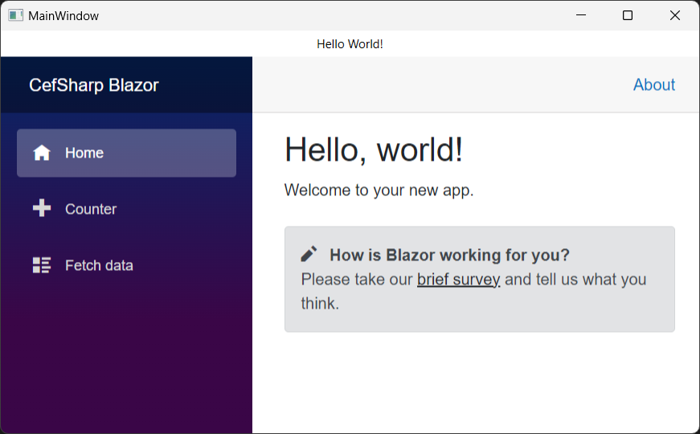

# Baksteen.Blazor.CefSharp
Build Blazor hybrid desktop applications using this Chromium based Blazor webview component for WPF. The component uses the excellent [CefSharp](https://github.com/cefsharp/CefSharp) as the underlying webview.
Includes Blazor hybrid demo app.

## Screenshot

